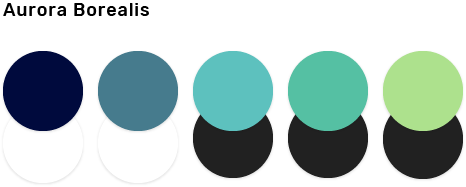
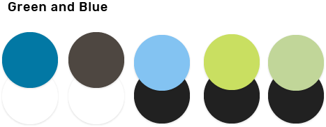

# Colour

### Palettes

Colour palettes consist of an array of colours that are used consistently within your particular application. Colour palettes are designed to work harmoniously with each other often incorporating primary colours, and secondary accent colours that are used to add variety and visual appeal to your application. The colour palette starts with primary colours, and builds on hues of that colour to create a complete and usable palette .

Themes enable consistent application styling through surface shades, shadow depth and ink opacity.

We have created other sample colour palettes that you may wish to use in your own system. Please see each swatch for corresponding text colour.

Hex codes \(left to right\): \#000A3D, \#467B8D, \#5DC1BE, \#55C0A3, \#ADE18D

Hex codes \(left to right\): \#0D467D, \#137991, \#6DD2DA, \#FF9F40, \#FEC04F

Hex codes \(left to right\): \#7E0C33, \#024571, \#5DC1BE, \#F6CF22, \#EDDB7C

Hex codes \(left to right\): \#0278A4, \#4E474, \#83C3F2, \#C9DF61, \#C1D699

### Applying Your Own Palettes

When creating your application or website you can apply your own colour palettes to various elements. When putting together your own colour combinations, it is recommended that you choose at least one primary colour, two or three secondary colours that are similar and an accent colour.

For Government of Canada applications it is required that all colours meet the WCAG AA accessibility level, though AAA is ideal. You can use [online contrast checkers](https://webaim.org/resources/contrastchecker/) to ensure that the colours you choose meet accessibility standards when combined with text.

Once chosen, you can apply your own colours simply by modifying the hex codes in your CSS for various elements.

### Colours Used in This System

Elements in this system use a simple and neutral colour palette that works well across multiple applications with various branding styles.

Throughout the design system, documentation about elements will specify which colour is used.

The palette used in this system is titled** Thunder and Lightning** and uses the following hex codes:

\#002D42 \(with white text\)

\#4D5D6C \(with white text\)

\#96A8B2 \(with black text\)

\#CECECE \(with black text\)

\#FEC04F \(with black text\)

### Text Colours

#### Black Text

Text in this design system is displayed in an off-black colour. Black text can be used on any light background \(see: Light Theme\) or any button or element that uses a light colour. When adding text to any background that is not black it is essential to check the contrast for accessibility. Significant contrast between the background/element colour and the text ensures readability, even for those with visual impairments such as colour blindness.

Please see [_Typography_](/typography.md) for more information about using text colour.

_**\(include a do/don't image\)**_

**Hex code**: \#212121

#### White Text

Light text in this design system is displayed in an off-white colour. White text can be used on any dark background \(see: Dark Theme\) or any button or element that uses a dark or light colour. When adding white text it is essential to check the contrast for accessibility. Significant contrast between the background/element colour and the text ensures readability, even for those with visual impairments such as colour blindness.

Please see [_Typography_ ](/typography.md)for more information about using text colour.

_**\(include a do/don't image\)**_

**Hex code**: \#FFFFFF

#### Muted Text

Muted text is used for secondary text elements such as captions, placeholder text and timestamps. This muted text colour only works on light backgrounds \(see: Light Theme\) or light-coloured elements. For dark backgrounds or bright/dark elements, use white text.

Please see [_Typography_](/typography.md) for more information about using text colour.

_**\(include example\)**_

**Hex code**: \#5E515A

### Colour Themes

#### Light Theme

By default, most applications will follow the light theme. This theme includes various shades of white for different background/foreground levels.**             **

Hex codes: \#E0E0E0, \#F5F5F5, \#FAFAFA, \#FFFFF**                       **

#### Dark Theme

Some applications may wish to also incorporate a dark theme. This theme includes various shades of black and grey for different background/foreground levels.

Hex codes: \#000000, \#212121, \#303030, \#424242

### System Alerts and Messaging

This design system uses the same alerts and messaging colours as described in the Web Experience Toolkit:

Please refer to the alerts section and the colour section for more information.

#### Info Colours

_**Info colours are used when providing additional information and notes to the user. **_

**Info hex codes:  **

•    \#245269

•    \#269ABC

•    \#D7FAFF

#### Warning Colours

_**Warning colours are used for notices that require the user’s acknowledgement.**_

**Warning hex codes:  **

•    \#66512C

•    \#FF9900

•    \#F9F4D4

#### Error Colours

_**Error colours are used to indicate system failures and malfunctions. **_

**Error hex codes:  **

•    \#923534

•    \#D3080C

•    \#F3E9E8

#### Success Colours

_**Success colours are used when confirming that the user’s input was successful. **_

**Success hex codes:**

•    \#2B542C

•    \#278400

•    \#D8EECA

