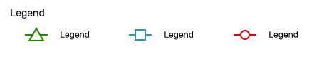

# Data: Line Graphs

## Legends

* Only use when necessary 
* Typically side placement, bottom placement when there is a secondary axis
* Do not rely only on colour, shapes help distinguish data points  

## Timelines \(or run charts?\)

Timelines are a type of line graph that are used to show changes in data over time. The time value should always be represented on the x-axis.

A great feature to add to your timeline is the ability for users to zoom in and out to particular periods of time represented on your graph. 

## Area Graphs

\(Need image\)

* use for part-to-whole relationships
  * Cognitively implies relationship \(subtraction or addition\)

OR

* to show volume \(discrete objects\)
  * one or two objects \(too messy and hard to read otherwise\)
  * lower opacity \(should be able to see both\)

