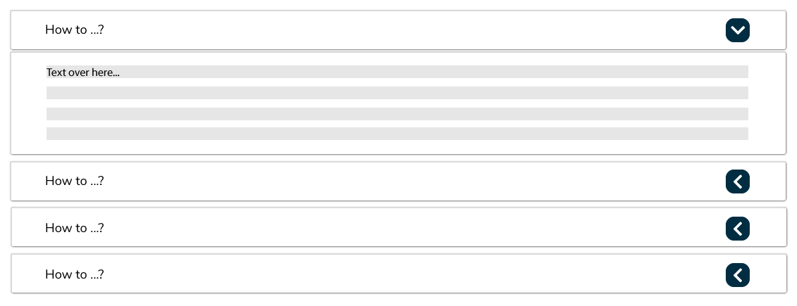

# Drawers and Accordions

**Accordions** are vertically stacked menus, with content nested in headers. Clicking a header either shows or hides content. Using accordions reduces scrolling, and makes the task of reading a page less daunting for the user as they can more easily locate the content they want to find. 

**Drawers** are menus that slide in and out from the side of the screen and show the site’s main navigation menu. The main purpose of drawers are navigation. Using drawers helps users complete tasks faster by organizing top-level tasks into hierarchical lists and grouping related items together. Placing navigation options within drawers allows users to focus on the main content of the page without being distracted or overwhelmed by too many options.

## Best Practices 

### Accordions

Accordions can be used for navigation or for information. 

Accordions should only be used when content is discrete, do not use if points of content overlap. Accordions are best when the user would be only looking for no more than a few points of content. If it is likely the user would need to click on several of the headers, it is better to show all of the information on the same page.  

### Drawers

Drawers should be coplanar. They are best used for top-level navigation in order to provide lateral navigation for users to easily move between screens at the same level of hierarchy and navigate between related items in a set.

Destination labels in a navigation drawer should indicate actionable list items and be organized based on user importance, with frequent destinations listed first and related destinations grouped together. Icons can be used to supplement drawer labels for further navigational clarity.

## Accordion Templates

### Navigation Accordion

Navigation menus with accordions can make navigating your site easier for the user.

### Information Accordion

Using accordions to nest information, especially for help content, can make finding answers easier for users.

## Drawer Templates

_\[to insert .png for nav drawers\]_ 

Drawers allow users to simultaneously access site content and drawer destinations within the same navigation plane.

Drawers can be permanently visible or hidden when not in use by clicking the navigation menu icon \(often a hamburger menu icon - or any symbol representing menu\) which indicates there is more content to be shown.

Navigation menus with drawers provide users with quick access to important actions. The contents of a drawer are contained within a menu that opens from the left side of the screen.  

