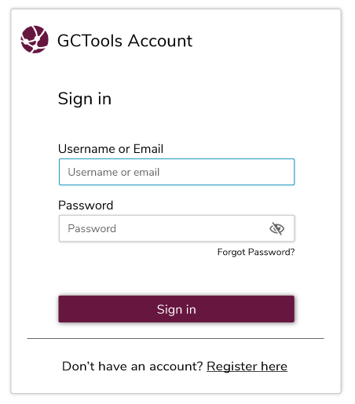
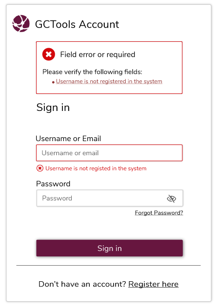

# Forms: Input Fields

## Text Area

The text field a user has selected should indicated visually. Outlining the selected text box in blue shows the user which field they are inputting without too much visual weight.

When there is an error within a text field, outlining the field in red shows a greater level of significance than blue.

## Date Boxes

_**Calendar vs text field \(issues w/ ie\) Include both examples?**_

