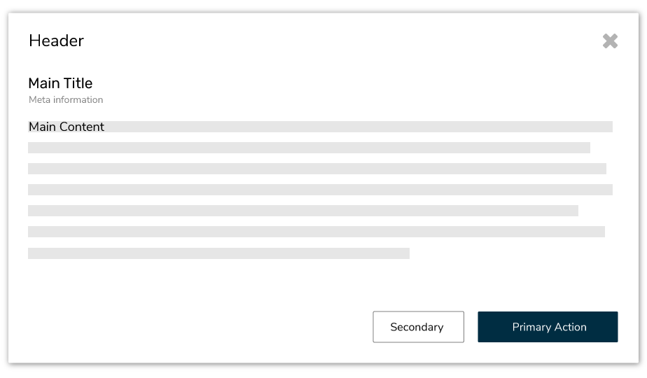

# Modals

Modals are overlay messages that show users information on the page they are on. They should be used for actions or information that the user must acknowledge before proceeding. Modals prevent the user from accessing the parent page until the modal has been clicked out of or dismissed.

## Types of Modals

Alerts - Urgent interruptions, required acknowledgement (deleting stuff, nav, irreversible)

Simple Menus - Lists -choice, ringtone

Confirmation - Single action

_**Come up with examples**_

## Best Practices

Modal text should be short and precise so that the user clearly knows what the modal is stating or asking. The title should appear at the top, with the action button appearing on the bottom. The title can be a question or not, depending on the context. The action button should clearly state the action the user will be taking, for example "cancel and delete" vs "no and yes". The main content of the modal should clearly describe the situation. Do not use messages like "Are you sure?".

How the user dismisses the modal depends on the severity of the action. Secondary action modals can be dismissed by clicking "X", appearing in the top right corner, or by clicking outside of the modal box. Primary actions should not have these options for dismissal, and should only be closed by selecting an action.

Typically a modal should not cover a user's entire screen. The only exception is for a (full screen) complex modal on a mobile.

Modals can open up additional modals, however you should be careful to not have too many layers of modals as this increases visual noise.

## Components of a Modal

_**\(elaborate on\)**_

Modals can be made up of several components. Some examples are:

Title: (Overall description)

Subtitle: (specific call-to-action)

Meta Information:

Main Content:

Image:

Buttons:

## Modal Templates

_**Sizing**_

-width is consistent, height will vary

