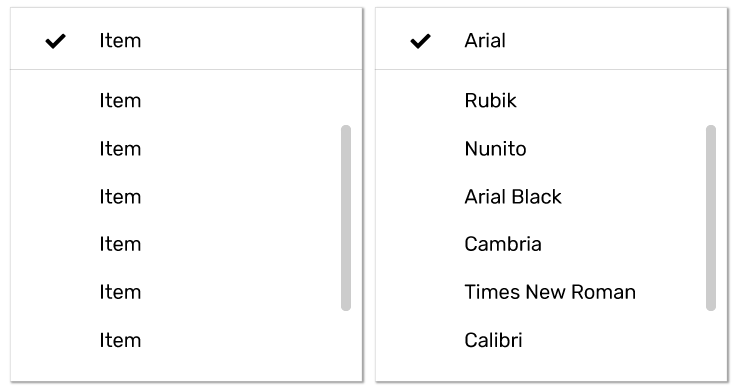

# Menus


Menus are used to display lists of choices the user can select \(**parallelism?**\). Menus can be used for lists of actions, as well as a form of navigation.

## Best Practices

Menus must contain at least two items, and each item should only be a single line of text. Menus can be exited by clicking outside of the menu, or by selecting the action, unless multiple actions can be selected, or selecting a navigation point. Menus should typically only have one level of nesting. 

Interaction w/button

-Ordering -- static vs dynamic

-Nesting -- no more than one level, ideally

-location -- top level \(emitting element -- for context\)

-Temporary? 

## Action Menus \(need different name\)

Action menus are temporary lists of choices a user can make. 

### Static Action Menu

#### 

They can consist of both** primary actions** and options which affect the page. Menu items can contain icons, and checkboxes.  **\(Do we want different symbols for multiple items vs different states?\). **Menus should be internally scrollable. 

Action menus can be static or contextual. Static menus have fixed options in the same order. Contextual menus dynamically change available options, or the order of the items in the list. 

#### Labels

-concisely and accurately

#### Contextual

-dynamic

### Cascading Menus

-desktop

#### Inline

### Simple Menus

-mobile or tablet

-vertical

-nesting is vertically aligned on top of selected item

-left aligned

## Navigation Menus

### Menu Bar \(merge w/tabs? or vice versa?\)

### Mega-menus

-type of expendable menu

-**subcategories** \(what makes it different from other menus\)

-two dimensional, groups of navigation items

-structured

-static

-everything is visible at once

#### Timing

### Static \(merge w/sidebar? or vice versa?\)

## Hybrid

